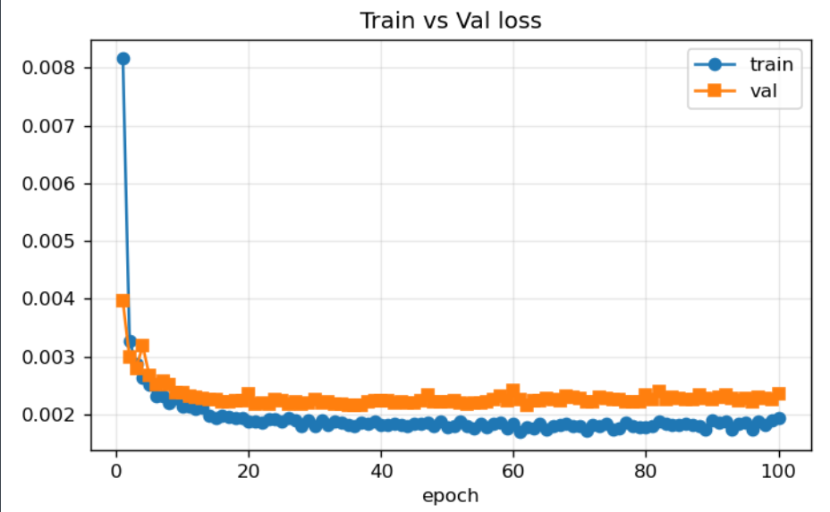
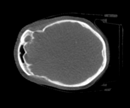
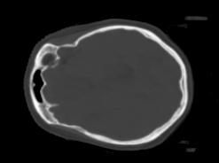
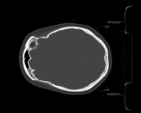
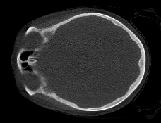
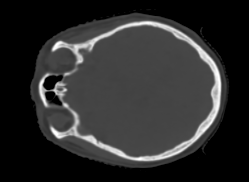
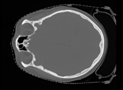
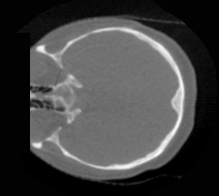
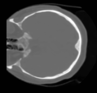
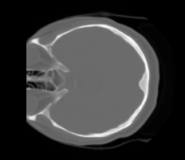

# Conditional DDPM — CBCT-to-CT Synthesis

This project is a **conditional Denoising Diffusion Probabilistic Model (DDPM)** for medical image translation, synthesizing diagnostic-quality CT (sCT) from cone-beam CT (CBCT) brain scans. CBCT is fast and low-dose but suffers from scatter noise and inaccurate Hounsfield Units (HU); planning-quality CT is the reference standard. The model learns the CBCT→CT mapping by training a UNet to denoise a corrupted CT image while a paired CBCT is supplied as a fixed conditioning channel. The architecture, diffusion schedule, and evaluation follow Junbo Peng et al. (Med. Phys. 2024), with a HU-calibration correction and a resume/convergence-tracking training loop added on top.

> Method reference (conditional DDPM for CBCT-to-CT): Peng et al., *Medical Physics* 2024 — https://doi.org/10.1002/mp.16704 <br/>
> Foundational DDPM: https://doi.org/10.48550/arXiv.2006.11239 <br/>
> UNet backbone follows the standard DDPM/`pytorch-ddpm` implementation (time-embedded ResBlocks + self-attention)

# Pipeline Overview

The project is organized as a four-stage pipeline. Sampling is the only expensive step and is run once; metrics and images can be regenerated from the saved `.npy` files without re-sampling.

```
python Train_condition.py     # train  -> ./Checkpoints/ (weights + convergence curves)
python Test_condition.py       # sample CBCT-conditioned sCT -> ./test/<run>/npy/<patient>/sCT/<slice>.npy
python metric_peng.py          # paper-style metrics (MAE / PSNR / NCC / SSIM), global + per-patient
python view_npy.py             # render [CBCT | sCT | GT] panels to PNG
```

- Stage 1: Data preparation — `datasets.py`
- Stage 2: Model & diffusion process — `Model_condition.py`, `Diffusion_condition.py`
- Stage 3: Training — `Train_condition.py`
- Stage 4: Sampling & evaluation — `Test_condition.py`, `metric_peng.py`

## Stage 1 — Data Preparation (`datasets.py`)

`BrainDataset` reads paired CBCT / CT / mask DICOM slices from `brain_DICOM/<patient>/{cbct,ct,mask}/`, and applies several domain-specific corrections:

- **HU calibration fix for CBCT:** the CBCT `RescaleIntercept` tag is inconsistent across patient series (e.g. `2BA=0`, `2BB=-1000`, `2BC=-1024`), while CT is consistently `-1024`. The intercept for CBCT is therefore **forced to `-1024`**, ignoring the incorrect tag, so CBCT and CT share the same HU scale for every patient. CT keeps its own (correct) tag.
- **HU windowing & normalization:** intensities are clipped to `[-1000, 2000]` HU and linearly mapped to `[-1, 1]`.
- **Background masking (`apply_mask_to_image=True`):** pixels outside the body mask are forced to `-1` (≈ air) in the *image*, not in the loss — this keeps the background trained and stable during sampling.
- **Explicit patient-level split:** train / val / test are split by patient ID (hard-coded `VAL_PATIENTS` / `TEST_PATIENTS`) so no patient leaks across splits. Slices are resized to 256×256 (bilinear for images, nearest for masks).

Each sample returns `{"CBCT", "pCT", "mask", "patient", "slice_name"}`.

**HU calibration check (before vs after forcing intercept = −1024).** `HU_check_intercept.py` measures, inside the body mask, the mean absolute error (MAE, in HU) of CBCT against ground-truth CT — with the original DICOM tag (`before`) and with the forced −1024 (`after`):

| patient / slice | orig_int | MAEbefore | MAEafter |
| --- | ---: | ---: | ---: |
| 2BA007 / slice_0001 | 0 | 630 | 412 |
| 2BA014 / slice_0174 | 0 | 1193 | 223 |
| 2BA035 / slice_0118 | 0 | 1212 | 231 |
| 2BA056 / slice_0077 | 0 | 1172 | 185 |
| 2BA077 / slice_0061 | 0 | 952 | 109 |
| 2BB011 / slice_0122 | −1000 | 187 | 203 |
| 2BB049 / slice_0045 | −1000 | 270 | 286 |
| 2BB109 / slice_0129 | −1000 | 270 | 288 |
| 2BB179 / slice_0044 | −1000 | 259 | 275 |
| 2BC014 / slice_0078 | −1024 | 99 | 99 |
| 2BC042 / slice_0043 | −1024 | 83 | 83 |
| 2BC070 / slice_0216 | −1024 | 182 | 182 |

- **Series 2BA (wrong tag, intercept 0):** MAE before correction is ~630–1210 HU; forcing −1024 drops it to ~110–410 HU — a several-fold reduction (e.g. 1193 → 223). This is the calibration bug being removed.
- **Series 2BB / 2BC (tag already at/near −1024):** MAE barely changes, because their CBCT was already on the correct HU scale. The residual ~80–290 HU is genuine CBCT-vs-CT difference (scatter/artifacts) — what the model is meant to fix, not a calibration issue.

## Stage 2 — Model & Diffusion (`Model_condition.py`, `Diffusion_condition.py`)

- **UNet backbone:** time-embedded residual blocks with self-attention, base width `ch=128`, channel multipliers `[1, 2, 3, 4]`, attention at resolution level `[2]`, 2 residual blocks per level. The network takes **2 input channels** (the noised CT + the CBCT condition) and predicts a **1-channel** noise estimate.
- **Conditioning:** the CBCT is concatenated on the channel dimension and held **constant across every diffusion step** — only the CT channel is noised and denoised. Channel order (ch0 = CT target, ch1 = CBCT condition) is load-bearing and must not be swapped.
- **Forward process (`GaussianDiffusionTrainer_cond`):** T=1000 steps, linear β schedule `1e-4 → 0.02`. Training objective is MSE between predicted and true noise, with **`reduction='mean'`** (a `'sum'` reduction produced huge gradients that `grad_clip=1` crushed, stalling training).
- **Reverse process (`GaussianDiffusionSampler_cond`):** ancestral sampling using the posterior variance, re-concatenating the CBCT condition at each step.

## Stage 3 — Training (`Train_condition.py`)

Implements the paper's training procedure with production conveniences on top.

- Optimizer: **AdamW**, lr `1e-4`, β=(0.9, 0.999), `weight_decay=0` (effectively Adam), batch size 2, dropout 0.3, gradient clipping at 1.
- **Resume support:** `RESUME_FROM` accepts a full `resume_state.pt` (weights + optimizer + epoch + history → seamless continuation) or a bare `ckpt_N_.pt` (warm start, weights only). `n_epochs` is always the *final* target epoch count.
- **Locked validation:** a fixed random subset (`VAL_MAX_SLICES=600`) with a frozen `VAL_SEED` so validation loss is comparable epoch-to-epoch.
- **Outputs (`./Checkpoints/`):** `ckpt_N_.pt` model weights (every 5 epochs), `resume_state.pt`, `loss_log.csv`, `loss_curve.png`, and a 4-panel `convergence.png` (train vs val, val−train gap, gradient norm, |Δtrain loss|).

| Parameter | Value | Note |
|---|---|---|
| `T` | 1000 | diffusion steps (matches paper) |
| `ch`, `ch_mult` | 128, `[1,2,3,4]` | UNet width |
| `attn` | `[2]` | resolution level with attention |
| `num_res_blocks` | 2 | residual blocks per level |
| `lr`, `batch_size` | 1e-4, 2 | AdamW |
| `dropout`, `grad_clip` | 0.3, 1 | |
| `beta_1`, `beta_T` | 1e-4, 0.02 | linear schedule |
| `seed` | 42 | reproducibility |

> The model typically converges around epoch 20–30; the default `n_epochs=200` is intentionally generous headroom, not a required target.

**Loss curve (training vs validation):**




Both the training and validation loss drop steeply in the first few epochs and then flatten out and track each other closely — a sign that the model has converged and is not overfitting.

## Stage 4 — Sampling & Evaluation (`Test_condition.py`, `metric_peng.py`)

- **Full-chain sampling (paper Algorithm 2.2):** start from pure noise `x_T ~ N(0, I)`, denoise all T steps with the CBCT concatenated as a constant condition, then re-mask the background to `-1`. Per-slice seeding makes results reproducible. Each slice is saved as a `(3, 256, 256)` HU array `[CBCT, sCT, GT]` under `./test/<run>/npy/<patient>/sCT/`, with `RESUME=True` skipping already-sampled slices.
- **Metrics (`metric_peng.py`):** computes MAE, PSNR, and NCC (Pearson correlation) exactly as defined in the paper (full image), plus SSIM as an extra, and an optional in-mask ROI variant. Emits per-patient CSVs and a global mean±std summary.

### Results (test set, full image)

Inference Results at Epoch 100
For each set, the middle slice of the data is used.
<table>
  <thead>
    <tr>
      <th align="center">Patient</th>
      <th align="center">CBCT (input)</th>
      <th align="center">sCT (this model)</th>
      <th align="center">CT (ground truth)</th>
    </tr>
  </thead>
  <tbody>
    <tr>
      <td align="center"><b>2BA063</b></td>
      <td></td>
      <td></td>
      <td></td>
    </tr>
    <tr>
      <td align="center"><b>2BB109</b></td>
      <td></td>
      <td></td>
      <td></td>
    </tr>
    <tr>
      <td align="center"><b>2BC070</b></td>
      <td></td>
      <td></td>
      <td></td>
    </tr>
  </tbody>
</table>

Computed over the held-out test patients (`metrics_peng.csv`):

| Comparison items | MAE | PSNR | NCC |
| --- | --- | --- | --- |
| Original Paper | 25.99±11.84 | 30.49±3.73 | 0.99±0.01 |
| Epoch_100_Full | 31.13861304 | 24.39186087 | 0.964869565 |
| Epoch_100_roi | 76.97120435 | 21.02089565 | 0.935452174 |

The sCT reduces MAE against ground-truth CT by roughly **3×** versus the raw CBCT input, confirming the HU correction and structural translation are working. (PSNR here uses the paper's max-pixel definition on data clipped to `[-1000, 2000]` HU, so it is a slightly conservative apples-to-oranges comparison with the paper's number.)


# Engineering & Evaluation

Beyond the model itself, the project includes tooling for training stability, evaluation accuracy, and clinical export:

- **Convergence diagnostics:** training auto-generates a 4-panel plot (train vs val loss, val−train gap for overfitting onset, gradient-norm stability, and log |Δtrain loss| for plateau detection) plus clean CSV logs for offline plotting.
- **Reproducible, locked evaluation:** validation runs on a fixed seeded slice subset; sampling uses a per-slice seed so any run can be reproduced exactly.
- **Paper-faithful metrics with ROI comparison:** `metric_peng.py` reports both full-image (paper definition) and in-mask ROI metrics side by side, per patient and globally, so full-vs-ROI discrepancies are visible.
- **DICOM export (`npy_to_dicom.py`):** converts sCT `.npy` back to a proper DICOM series with correct HU calibration (`RescaleIntercept=-1024`), and offers geometry modes (`match_ct` / `display_only` / `square`) to restore the original non-square FOV so sCT overlays correctly on the source CT/CBCT.
- **Inspection utilities:** `view_npy.py` (render `[CBCT | sCT | GT]` panels at any window without re-sampling), `HU_check.py` and `inspect_dicom.py` (verify HU calibration and DICOM tags), `nifti_to_dicom.py` (format conversion), and `compare_*.py` (ablation/variance comparisons).

# Environment Setup

The project targets Python 3.11 + PyTorch 2.x with CUDA, on a Linux server. Core dependencies: `torch`, `numpy`, `pydicom`, `scikit-image`, `matplotlib`, and `tqdm`.

### 1. Install Conda (Miniconda recommended)

```bash
wget https://repo.anaconda.com/miniconda/Miniconda3-latest-Linux-x86_64.sh
chmod +x Miniconda3-latest-Linux-x86_64.sh
./Miniconda3-latest-Linux-x86_64.sh
source ~/.bashrc
```

### 2. Create the environment

```bash
conda create -n proj python=3.11
conda activate proj
pip install torch torchvision pydicom scikit-image matplotlib tqdm numpy
```

### 3. Configure the dataset path

Set `dataset_name` in `Train_condition.py` / `Test_condition.py` to your DICOM root, structured as:

```
brain_DICOM/<patient_id>/cbct/slice_xxxx.dcm
brain_DICOM/<patient_id>/ct/slice_xxxx.dcm
brain_DICOM/<patient_id>/mask/slice_xxxx.dcm
```

### 4. Run

```bash
python Train_condition.py     # train
python Test_condition.py       # sample sCT
python metric_peng.py          # evaluate
```

Run all commands from the project root so `Diffusion_condition.py`, `Model_condition.py`, and `datasets.py` resolve as imports; checkpoints are written to `./Checkpoints/` relative to that directory.
